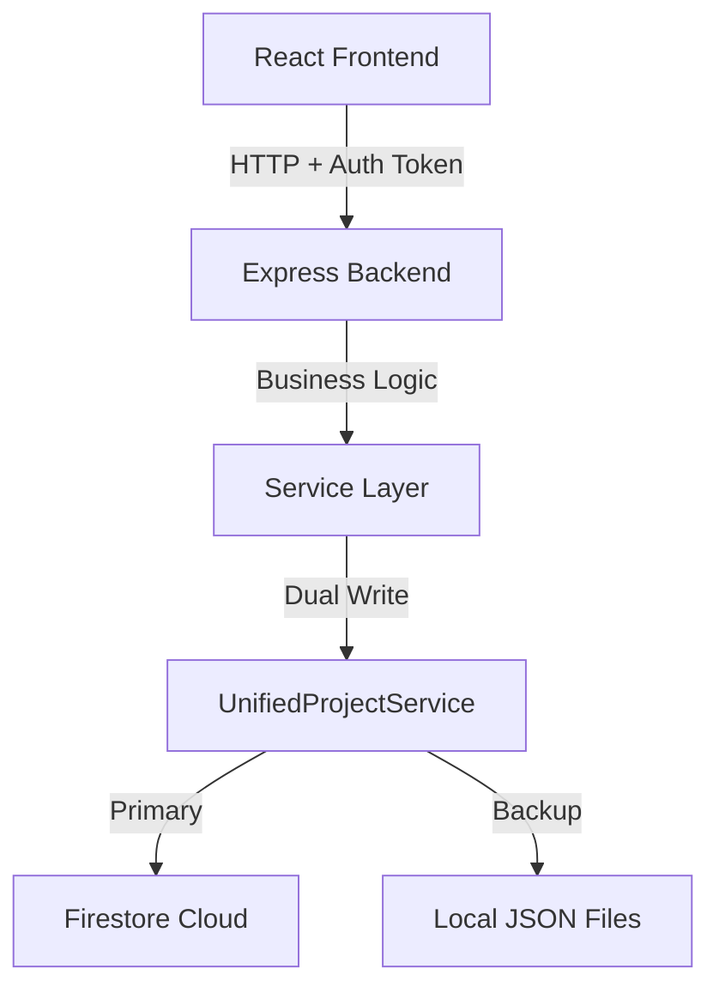
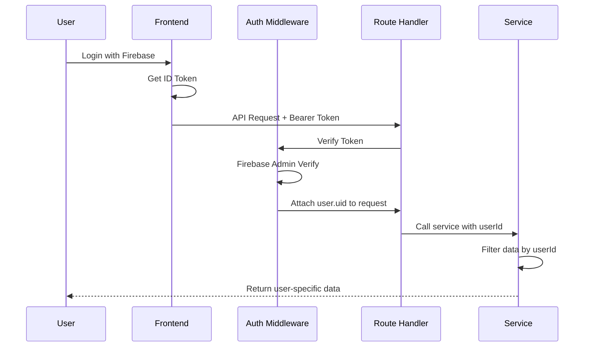

# 🏗️ Architecture Guide - Bug Binder

## System Overview

Bug Binder uses a **3-Layer Architecture** with **Dual-Storage** for reliability.



## Core Architectural Patterns

### 1. Dual-Write Strategy (CRITICAL)

**Rule**: ALL data writes MUST use `UnifiedProjectService`.

**Flow**:
```typescript
// ✅ CORRECT
import { unifiedProjectService } from '../services/persistence/UnifiedProjectService';
await unifiedProjectService.createProject(name, description, userId);

// ❌ WRONG - Bypasses cloud sync
import { projectModel } from '../models/Project';
await projectModel.create({...}); // DON'T DO THIS
```

**How It Works**:
1. Service layer receives request
2. `UnifiedProjectService` writes to **Firestore** (cloud) FIRST
3. If successful, writes to **Local JSON** (backup)
4. Returns result to client

**Why**: Ensures data availability even if cloud is down, and enables offline work.

### 2. Authentication Flow



**Implementation**:
- File: `backend/src/middleware/auth.ts`
- Every protected route checks `req.user.uid`
- Service methods MUST accept `userId` parameter

### 3. Data Hierarchy

```
User (Firebase Auth)
└── Projects (Firestore: /projects/{id})
    ├── Pages (/projects/{id}/pages/{pageId})
    ├── Scripts (/projects/{id}/scripts/{scriptId})
    ├── Test Runs (/projects/{id}/test_runs/{runId})
    ├── Daily Data (/projects/{id}/daily_data/{date})
    └── File System Nodes (Local + Cloud)
```

**Rule**: EVERY database query MUST scope by:
1. `user_id` (security)
2. `project_id` (isolation)

## Layer Breakdown

### Layer 1: Routes (`backend/src/routes/`)

**Purpose**: Define HTTP endpoints and delegate to services.

**Files** (29 total):
- `persistence/projects.ts` - Project CRUD
- `execution/runner.ts` - Test execution
- `ai/core.ts` - AI features
- `integration/auth.ts` - Authentication

**Pattern**:
```typescript
router.post('/', async (req, res) => {
  try {
    const userId = (req as any).user?.uid; // From auth middleware
    if (!userId) return res.status(401).json({ error: 'Unauthorized' });
    
    const result = await SERVICE.method(data, userId);
    res.json(result);
  } catch (error) {
    console.error('Error:', error);
    res.status(500).json({ error: 'Failed' });
  }
});
```

### Layer 2: Services (`backend/src/services/`)

**Purpose**: Business logic and database operations.

**Files** (21 total):
- **Persistence**:
  - `UnifiedProjectService.ts` - **THE BRAIN**: Coordinates dual-write
  - `LocalProjectService.ts` - Local JSON operations
  - `ProjectService.ts` - Firestore operations
  - `TestDataService.ts`, `SuiteService.ts`, etc.
  
- **Execution**:
  - `TestRunnerService.ts` - Playwright execution
  - `RecorderService.ts` - Script recording
  - `SchedulerService.ts` - Cron jobs
  
- **AI**:
  - `GenAIService.ts` - AI test generation

- **Integration**:
  - `GitService.ts` - Version control

**Pattern**:
```typescript
export class MyService {
  /**
   * What: Creates a resource
   * Why: User needs to organize data
   * How: Validates, writes to DB, returns result
   */
  async create(data: MyData, userId: string): Promise<Result> {
    // Validate
    if (!data.name) throw new Error('Name required');
    
    // Persist via UnifiedService
    return unifiedProjectService.createResource(data, userId);
  }
}
```

### Layer 3: Models (`backend/src/models/`)

**Purpose**: Data schemas and validation.

**Pattern**:
```typescript
export interface Project {
  id: string;
  name: string;
  description: string;
  user_id: string;
  createdAt: string;
  updatedAt: string;
}
```

## Data Storage Details

### Firestore Collections

```
/users/{uid}
/projects/{projectId}
  - name, description, user_id, createdAt
  /pages/{pageId}
  /scripts/{scriptId}
  /test_runs/{runId}
  /daily_data/{date}
```

### Local JSON Files

```
backend/data/
├── projects.json              # List of all projects
└── projects/
    └── {projectId}/
        ├── data.json          # Project metadata + sub-resources
        └── scripts.json       # (deprecated, merged into data.json)
```

## Execution Engine

Bug Binder has **3 automation engines**:

1. **Recorder** (Playwright API Mode)
   - Records user actions in browser
   - Generates JSON script format
   - Has self-healing (finds elements via multiple selectors)

2. **Dev Studio** (Playwright CLI Mode)
   - Runs scripts for testing
   - Exports JSON → `.spec.ts` → Executes via `npx playwright test`

3. **Orchestrator** (Playwright CLI Mode)
   - Production-level batch execution
   - Scheduled runs via cron
   - Parallel execution support

**Common Flow**:
```
JSON Script → Temp File (.spec.ts) → npx playwright test → Capture Logs → Store Results
```

## Key Design Decisions

### Why Dual-Storage?
- **Reliability**: Works offline
- **Performance**: Local reads are instant
- **Backup**: Cloud failure doesn't lose data

### Why UnifiedProjectService?
- **Single Point of Control**: One place to modify persistence logic
- **Consistency**: Can't forget to sync
- **Testing**: Easier to mock one service

### Why Not Use ProjectModel?
- It's legacy code from a previous agent
- Missing cloud sync
- Creates race conditions with UnifiedProjectService
- **Status**: Unused dead code, safe to delete

## Critical Files (Do Not Modify Without Understanding)

1. `UnifiedProjectService.ts` - Dual-write coordinator
2. `auth.ts` (middleware) - Security gatekeeper
3. `index.ts` (backend) - Server initialization
4. `LocalProjectService.ts` - File locking + atomic writes

---

**Next**: Read `PROJECT_STRUCTURE.md` to understand file organization.
